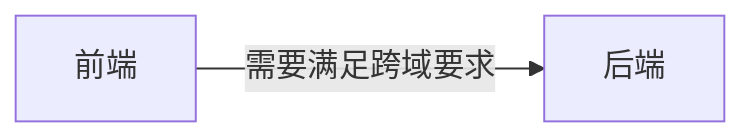
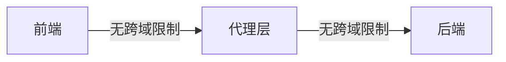
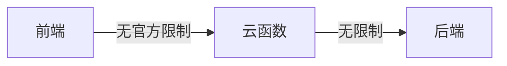

## 背景
### 介绍
本文介绍了 `uni-app` 小程序中如何通过云函数代理转发，请求不符合小程序限制要求的域名。（原生小程序同理）

### 关键词
云函数、代理转发、ICP 备案、小程序

### 小程序限制
在小程序开发中，有很多限制，其中有一个限制就是：当小程序需要请求后端接口时，对后端域名有一些限制：[限制说明](https://developers.weixin.qq.com/miniprogram/dev/framework/ability/domain.html#%E9%99%90%E5%88%B6%E8%AF%B4%E6%98%8E)

- 域名只支持https协议，不支持IP地址；
- 业务域名需经过ICP备案；

这就导致个人开发者和个人开发学习会比较麻烦，需要找一些方式绕过这个限制。


## 代理转发
代理转发在前端的应用很广，一个常见的应用场景，就是解决前端的跨域问题。
前端访问跨域资源时，是存在跨域限制的；
前端请求资源限制


而服务器访问服务资源时是没有问题的。通过这个方式，我们在前端工程化开发中，配置 devServer , 本地开启一个代理服务器。前端先请求代理服务器，然后由代理服务器请求真正的服务端接口。然后在拿到数据以后，返回给前端数据。



这在现在的前端开发中，解决本地开发代理问题，应该是最常用的方式。（线上通过 nginx 代理解决）

### 云函数代理
github 中有一个项目 [v-request](https://github.com/guren-cloud/v-request),就是通过云函数代理来解决本文讨论的域名限制问题的。

原理就是小程序只限制了前端的域名访问，但是没有限制云函数的请求。


而在 `uni-app` 框架中，用云函数来代理就更合适了。

- 白嫖：在 `uni-app`中， 有一个免费的阿里云函数可以使用，开发学习和小规模的线上使用基本没有问题。
- 日志查询：无需日志添加，在管理后台，就可以可以根据用户信息，直接查询请求日志。

### 代码解释
#### 小程序代理
在小程序中，请求数据使用的 API 是 `request`。
在原生小程序中，使用 `wx.request`; 在 `uni-app`中, 使用 ` uni.request`。

为了实现代理功能，我们封装一个新的函数，来进行网络请求：

在这个函数中，我们请求云函数
```js
uni.urequest = function(options) {
	// ... other code

	uniCloud.callFunction({
		name: 'hack-request',
		data: {
			...
		},
		success: res => {},
		fail: err => {}
	})
}
```


#### 云函数转发
在云函数中，只做一层代理，将返回值原封不动的返回。
```js
const axios = require('axios').default;

exports.main = (evt, ctx) => {
  return new Promise((RES, REJ) => {
	try{
		axios.request(evt.options)
        .then(function (response) {
		  RES(response.data)
		})
		.catch(function (error) {
		  REJ(error)
		});
	}catch(e){
		REJ(e)
	}
  });
}
```

封装完上面两个函数，就可以开始体验效果了。

#### 如何使用
当进行网络请求的时候，我们需要调用封装好的函数 `uni.urequest`（叫什么都可以), 参数和 `uni.request` 完全一致。

```js
uni.urequest({
	url: this.requestUrl,
	method: "POST",
	data: {},
	success: (res) => {}, // 成功回调
	fail(err) {}, // 失败回调
	complete(){} // 成功和失败都会调用
}),
```

#### 加一点点细节
在 hack-request.js 中， 我们还做了一些特殊处理，能更好的应用到实际开发中。

##### code 判断
从 success 函数返回的，只是说明请求的网络状态正常。但是业务逻辑是否正常，通过还需要根据返回值的 code 进行判断。 

```js
success: res => {
	const { result } = res || {};
	const {
		code,
		msg,
		data
	} = result || {};
	
	// 如果请求的 code 状态码不正确
	if (code !== RIGHT_CODE) {
		options.fail && options.fail({
			errMsg: msg,
			err: msg,
			code,
		});
		REJ(res);
		return;
	}
	
	options.success && options.success(data);
	RES(data);
},
```

##### 公共 header
比如用户登录以后，每次请求都应该携带 token，那么我们直接在封装函数中设置一次就可以了。
```js
import store from '@/stores';
uni.urequest = function(options) {

	// 公共 header
	OPT['headers'] = Object.assign({
		// token， 从 store 中获得
		'Authorization': `Bearer ${store.state.token}`,
	}, options.header);

}
```

## uni-app 插件
uni-app 另一个优点就是有一个活跃的插件市场，我们将刚才的代码发布到插件市场，当其他人遇到这个问题的时候，就可以直接拿来使用了。

### 插件地址

### git 地址


## 参考项目
[v-request](https://github.com/guren-cloud/v-request)
