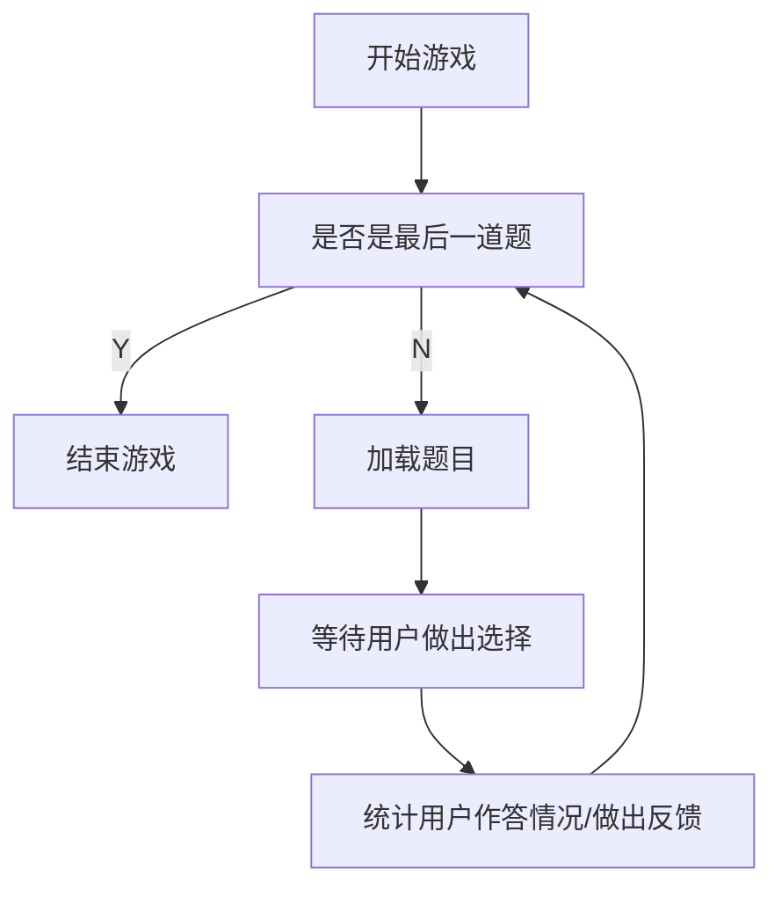
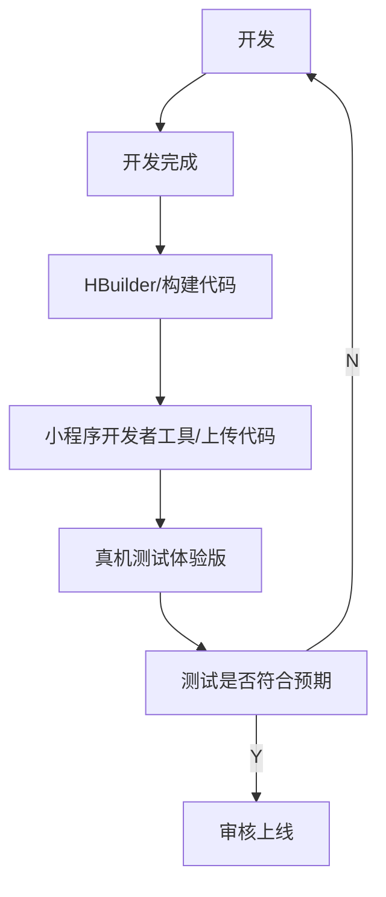

# 从零到一上线小程序

## 简介
### 本文内容
本文以最近比较火的”盛唐密盒“为背景，从零到一制作一个简单的答题小程序（技术栈为 `uni-app + vue2`）。文章内容包括：
1. 如何创建一个 `uni-app` 小程序；
1. 开发踩坑经验分享；

### 关键词
小程序、问答系统、uni-app

### 背景介绍
最近西安的"盛唐密盒"比较火，激发了作者对百科历史问答的兴趣。于是就想趁着热度，做一个小程序版本的问答游戏。

> “盛唐密盒”是由西安大唐不夜城景区推出的表演活动，该表演由两位扮演“房玄龄”和“杜如晦”的工作人员出题，并随机挑选游客上台参与答题。
> 这个活动类似环球影城的擎天柱，主持人会出一些题目，如果答对3道题，可以获得一个小礼物；如果答错3次就会拍一张合照，结束游戏。

### 选择技术栈
技术栈选择的是 `uni-app`。使用这个框架的优点如下：
1. 可以 使用 `vue` 写小程序的代码。
2. 支持跨端项目，比如 `IOS`、 `安卓`、`Web` ；
3. 支持其他应用小程序，如百度，支付宝等小程序；
4. 使用者比较多，社区比较活跃，遇到问题能够在社区进行解决；
5. 提供一个免费的阿里云服务空间，可以薅羊毛；（之前是不限量的，现在只剩一个了，而且需要每个月进行续期）

对于我来说，比较重要的是原因 1）、4）、5）

## 效果展示

### 截图
先看一下最后项目的效果（样式还没有进行优化，但是基本的答题逻辑是完整的）：

开始界面，点击按钮即可开始答案：

答题页面，题目是从题库随机抽取的。
当做完一道题以后，会根据答题情况，进行反馈。

当做对或者做错三道题以后，答题结束。

### 体验一下
小程序已经完成审核上线了，扫码可以体验一下线上效果

### GIT 地址
代码已经开源，如果觉得有点意思，欢迎点个免费的 Star。

[小程序源码](https://github.com/mamumu123/quiz)

##  开始

### 准备工作
- 下载 HBuilderX, 阅读 [`uni-app`开发文档](https://uniapp.dcloud.net.cn/)；
- 下载小程序开发工具，阅读 [小程序开发文档](https://developers.weixin.qq.com/miniprogram/dev/framework/quickstart/)

### 创建 uni-app 应用
HBuilderX 是 `uni-app` 官方推荐的编辑器，集成了比较多方便的功能。这里就使用 HBuilderX 进行开发；

[官方文档](https://uniapp.dcloud.net.cn/quickstart-hx.html) 有详细步骤说明，这里就以本文项目进行说明，然后加一些自己的理解；

> - 打开 HBuilderX 编辑器；
> - 点击工具栏里的文件 -> 新建 -> 项目；
> - 参数填写：填写名称、选择模板、vue 版本选择，是否启用uniCloud 

我选择的是`默认模板`、`vue2`、 `不启用云函数`

#### 默认模板
模板我选择的是`默认模板`，这个模板是一个能够正常运行，但是只有一个简单页面的项目，比较干净，可以直接进行开发。 类似 web 项目的 `create-react-app` 或者 `vue-cli`创建的项目；

#### vue2
`vue` 的版本我选择的是 `vue2`。 uni-app 的 vue3 感觉并不是很稳定，在官方的 [issueList](https://github.com/dcloudio/uni-app/issues) 中也可以看到很多的问题还是 open 的状态。
如果不小心踩到了官方的坑，1）浪费时间和精力；2）依靠自己还无法解决。还是稳妥一点选择 vue2 比较好；

#### 不启用云函数
项目比较简单的话，就不需要启用云函数了；

什么情况下使用云函数：
- 如果想要存储云端数据，可以薅一个阿里云服务空间；
- 如果自己的后端服务没有 icp 备案，或者不是 http 服务，可以使用云函数进行代理；

经过上面的简单步骤，一个 uni-app 项目就初始化好了。

### 引入组件库
为了快速搭建，直接使用了插件市场中很有人气的 UI 组件库 [uView](https://www.uviewui.com/components/intro.html)。

点击[链接](https://ext.dcloud.net.cn/plugin?id=1593)，进入插件市场，点击`使用 HBuilderX 导入插件`。

#### 配置
`npm安装方式`和`HBuilderX安装方式`是有不同的配置方式的
[npm安装方式](https://www.uviewui.com/components/npmSetting.html)
[HBuilderX安装方式](https://www.uviewui.com/components/downloadSetting.html)

## 游戏逻辑
经过上面两个步骤，项目架子就搭建好了，接下来开始逻辑开发。
首先进行业务逻辑的设计。

具体的逻辑代码放在 `pageQuiz/index/index.vue` 文件下，就不一行一行进行解释了,还是比较好理解的。

## 本地开发
点击工具栏的"运行" -> "运行到小程序模拟器" -> "微信开发者工具"
在编译完成以后，会打开小程序开发者工具，在模拟器里面可以看到实时效果。

### 重启大法
如果遇到奇怪的问题，觉得自己的代码没问题；尝试着重启HBuilderX, 说不定就没有问题了。

## 上线
[uni-app 部署文档](https://uniapp.dcloud.net.cn/quickstart-hx.html#%E5%8F%91%E5%B8%83%E4%B8%BA%E5%BE%AE%E4%BF%A1%E5%B0%8F%E7%A8%8B%E5%BA%8F)
[小程序发布文档](https://developers.weixin.qq.com/miniprogram/dev/framework/quickstart/release.html#%E5%8F%91%E5%B8%83%E4%B8%8A%E7%BA%BF)

开发完成，就可以准备部署到真机，体验真实效果了。

我的一般步骤是：

审核一般是一天以内会给出反馈。如果审核通过，在小程序管理后台进行上线就好了。

## 和 web 开发的区别
- 关于代码方面的区别，可以参考 [白话uni-app](https://uniapp.dcloud.net.cn/vernacular.html#)
- 限制多：不像 web 发版的便利，小程序每次发布都需要经过官方的审核。官方对于用户信息、使用场景都有诸多的限制，开发新功能前需要先行确认是否可行。

## 代码地址
https://github.com/mamumu123/quiz

## 参考
[uni-app 官方文档](https://uniapp.dcloud.net.cn/)

[小程序官方文档](https://developers.weixin.qq.com/miniprogram/dev/framework/quickstart/#%E5%B0%8F%E7%A8%8B%E5%BA%8F%E7%AE%80%E4%BB%8B)

[题目来源/Quiz-game](https://github.com/mingtingouyang/Quiz-game)